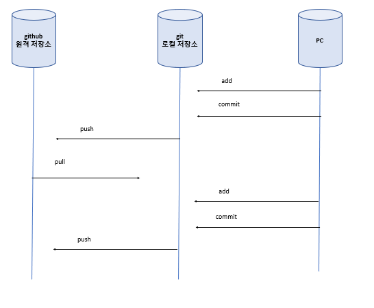

# git
## 해결하려는 문제
- 코드 변경 사항을 관리 하고 싶다
- 여러명이 공동으로 코드를 관리하는 공간이 있었으면 한다
- 과거에 작성한 코드로 복원하고 싶다

# github
- web application
- git이 없어도 코드 업로드가 가능하지만 대부분 git으로 연동해 사용한다
## 해결하려는 문제
- 로컬이 아닌 원격 서버에 코드를 저장
- 코드 리뷰, 이슈 등록 같은 협력에 도움되는 기능 제공

# 명령어
## 계정 등록
- git config --global user.name 이름
- git config --global user.email 이메일
- git config --list

## 파일 관리 상태 변경
- git init
  - 해당 폴더에 있는 파일 관리 시작
- git remote add origin [github 주소]
  - 로컬 저장소와 github 레퍼지토리를 연결
- git add 파일이름
  - 특정 파일 staging
- git add .
  - 모든 unchecked file staging
- git reset HEAD 파일이름
  - add 취소, staging에서 unchecked로 바꾸기 
- git commit -m "메세지"
  - commit시 메세지를 남긴다 
  - git commit만 입력하면 메세지 작성용 에디터를 띄운다
- git reset --soft HEAD^
  - commit 취소, 가장 최근 commit 파일을 staging 상태로 변경 
- git reset HEAD^
  - commit 취소, 가장 최근 commit 파일을 unchecked 상태로 변경
- git reset HEAD~2
  - commit 취소, 최근 2개 commit 파일을 unchecked 상태로 변경
- git commit --amend -m "메세지"
  - commit 메세지 재 작성
  - git commit --amend만 입력하면 에디터를 띄운다
- git push [remote name] [branch name]
- push 취소법

- git checkout [commit hash code]
  - push 전 커밋 기록보고 코드 상태 변경
- git checkout master
  - 최근 커밋으로 복구

## 파일 상태 확인
- git status
- git log --oneline
  - commit 기록 보기

## 내려 받기
- git fetch
- git pull
- git clone
  - git init + git remote add + git pull

## 병합
- git merge

## 브랜치
- git branch [브랜치 이름]
  - 브랜치 생성
- git checkout [브랜치 이름]
  - 브랜치 변경
- git branch
  - 브랜치 목록 확인 & 현재 브랜치 확인
- git checkout -b [브랜치 이름]
  - 브랜치 생성과 동시에 이동
- git branch -d [브랜치 이름]
  - 브랜치 삭제

## Issue

## Puul Request
- Comment
  - 리뷰를 남긴다
- Accept
  - 리뷰를 남기고, Merge를 승인한다
- Reques Change
  - 리뷰를 남기고, Merge를 거부한다

## Collaborators and treams
- Settings > Collaborators and Treams 에서 Write 권한을 등록해 준 user만 review를 남길 수 있다