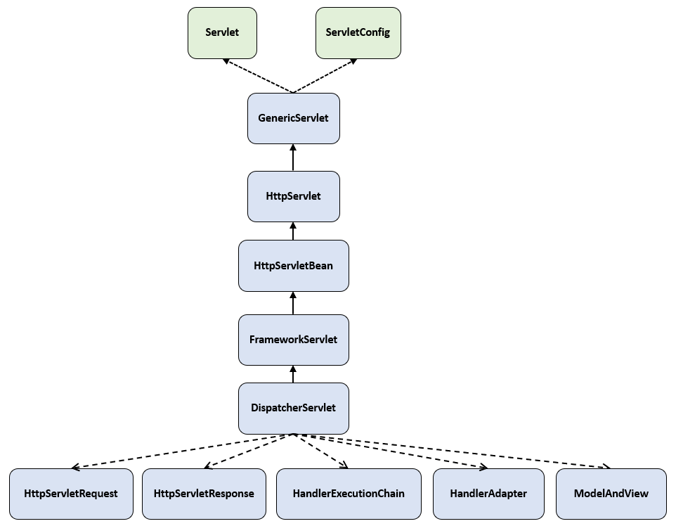

# Servlet
- 라이브러리
  - org.apache.tomcat.embed:tomcat-embed-core
- 패키지
  - javax.servlet
  - javax.servlet.http
- 클라이언트 동적 자원 요청에 응답을 반환하는 자바 모듈

## 배경 지식
- 웹 요청 응답 흐름
  - 브라우저가 서버와 TCP 통신 시작
  - 브러우저가 서버에게 Http Request 전송
  - 서버는 Response를 생성
  - 서버가 브라우저에게 Response 반환
  - TCP 통신 종료

## 해결하고픈 문제
- 브라우저와 서버가 통신하는 과정, Http Request를 파싱해 객체로 만드는 과정을 책임지는 객체
- 동시에 오는 다수에 요청에 대응하는 객체 


## 코드
```java
package javax.servlet;

import java.io.IOException;

public interface Servlet{
    public void init(ServletConfig config) throws SerletException;
    public ServletConfig getServletConfig();
    public void service(ServletRequest req, ServletResponse res) throws ServletException, IOException;
    public String getServletInfo();
    public void destroy();
}
```


```java
import javax.servlet.*;
import javax.servlet.http.*;

public abstract class HttpServlet extends GenericServlet{
    @Override
    public void service(ServletRequest req, ServletResponse res)
        throws ServletException, IOException {

        HttpServletRequest  request;
        HttpServletResponse response;

        try {
            request = (HttpServletRequest) req;
            response = (HttpServletResponse) res;
        } catch (ClassCastException e) {
            throw new ServletException(lStrings.getString("http.non_http"));
        }
        service(request, response);
    }

    protected void service(HttpServletRequest req, HttpServletResponse resp)
        throws ServletException, IOException {

        String method = req.getMethod();
        // GET, POST, PATCH, PUT, DELETE, OPTION, TRACE 에 맞춰 메서드 호출
    }
}

```


```java
public interface HttpServletRequest extends ServletRequest{}
```

```java
public interface HttpServletResponse extends ServletResponse{}
```


# DispatchServlet
## 책임(해결하고픈 문제)
- SpringBoot에서 Http Request를 가장 먼저 받는다
- HandlerMapping중 Request를 처리할 수 있는 Handler(url에 대응하는 컨트롤러에 메서드)

## 코드


```java
package org.springframework.web.servlet;


public class DispatcherServlet extends FrameworkServlet{
    private List<HandlerMapping> handlerMappings;
    private List<HandlerAdapter> handlerAdapters;
    
    @Override
    protected void doService(HttpServletRequest request, HttpServletResponse response) throws Exception{
        try {
			doDispatch(request, response);
		}
    }
    
    protected void doDispatch(HttpServletRequest request, HttpServletResponse response) throws Exception{
        HttpServletRequest processedRequest = request;
        HandlerExecutionChain mappedHandler = null;
        WebAsyncManager asyncManager = WebAsyncUtils.getAsyncManager(request);

        try{
            ModelAndView mv = null;
            try{
                mappedHandler = getHandler(processedRequest); // 요청을 처리할 수 있는 핸들러와 인터셉터를 담은 객체 생성
                HandlerAdapter ha = getHandlerAdapter(mappedHandler.getHandler()); // 핸들러를 호출할 객체 생성
                
                String method = request.getMethod(); // GET, POST, PATCH, PUT, DELETE, OPTION, TRACE
                
                if(!mappedHandler.applyPreHandler(processRequest, response)){  // 핸들러 호출 전 인터셉터 처리
                    return;
                }
                
                mv = ha.handle(processedRequest, response, mappedHandler.getHandler()); // 핸들러 호출, ModelAndView 객체 반환
                
                mappedHandler.applyPostHandle(processRequest, response, mv); // 핸들러 호출 후 인터셉터 처리
            }
            processDispatchResult(processedRequest, response, mappedHandler, mv, dispatchException);  // 
        }
    }
}
```


# HandlerMapping
## 책임(해결하고픈 문제)
- 클라이언트 요청을 처리하는 핸들러(url에 대응하는 컨트롤러에 메서드)를 찾는다

## 코드

```java
public interface HandlerMapping{
    HandlerExecutionChain getHander(HttpServletRequest request) throws Exception;
}

public abstract class AbstractHandlerMapping implements HandlerMapping{
    HandlerExecutionChain getHandler(httpServletRequest request) throws Exception{
        Object handler = getHandlerInternal(requet);
        HandlerExecutionChain executionChain = getHandlerExecutionChain(handler, request);
        return executionChain;
    }
}

public abstract class AbstractHandlerMethodMapping<T> extends AbstractHandlerMapping{
    protected HandlerMethod getHandlerInternal(HttpServletRequest request){
        String lookupPath = getUrlPathHelper().getLookupPathForRequest(request);
        try{
            HandlerMethod handlerMethod = lookupHandlerMethod(lookupPath, request);
            return (handerMethod != null ? handlerMethod.createWithResolveBean() : null);
        }
    }
}
``

```java
public class RequestMappingHandlerMapping extends AbstractHandlerMethodMapping{

}
```

# HandlerAdpater
## 책임(해결하고픈 문제)
- 핸들러를 실행시킨다
- 핸들러 처리 결과를 ModelAndView 객체로 받아 DispatcherServlet에게 전달한다

