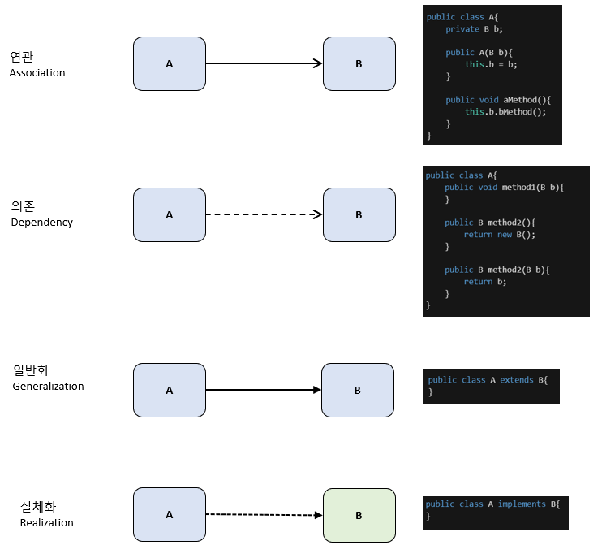

# 객체 지향 프로그래밍 OOP
- 책임을 가진 객체들에 역할 수행과 메세지 전달로 요구사항을 수행하는 프로그래밍 패러다임
- 객체는 속성(field)과 행동(method)을 갖는다

# 4가지 객체 관계

- 연관과 의존 관계는 관계 맺은 클래스(B)가 없으면 주체(A)는 역할을 수행할 수 없다
- 일반화와 실체화 관계는 관계 맺은 클래스(B)를 주체(A)가 구체화

## 응집도(Cohension)
- 한 클래스가 가진 메서드들에서 관계 맺은 클래스를 사용하는 정도

## 결합도(Coupling)
- 한 클래스가 관계 맺은 클래스에 메서드를 얼마나 많이 접근 할 수 있는지 정도

## 좋은 객체 설계
- 응집도는 높게, 결합도는 낮게 설계한다
- 객체에 코드 변경은 요구사항에 변경 뿐이며, 관계 맺은 객체에 변경이 전파되지 말아야 한다(단일 책임 원칙)

## 코드 변경
- 요구사항이 변경되어 기존 코드가 변경되는 상황
  - 메서드/필드 이름 변경
  - 메서드/필드 추가
  - 메서드/필드 제거
  - 메서드 파라미터 변경
  - 메서드 리턴 변경
  - 메서드 로직 변경

## 상속
### 목적
- 같은 메서드를 가진 클래스간에 중복 코드 제거

## 인터페이스와 구현
### 목적