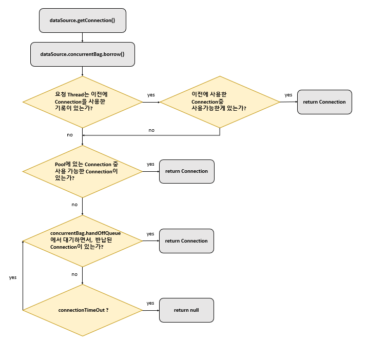

# Connection Pool
## 문제
- 서버와 데이터베이스 통신과정에 필요한 Connection 생성 소요 시간이 크다

## 해결
- 서버 최초 실행시 Connection을 여러개 만들어 두고, 필요시 가져다 쓰고 다 쓰면 반납하는 시스템을 만들자
- 구현체
  - HikariCP

## 코드

- HikariCP에 DataSource로 부터 Thread가 Connection을 가져오는 과정


- Thread가 HikariCp에 DataSource에 Connection을 반납하는 과정

```yml

```

```java
package javax.sql;


```

# 관련 에러
- SQLExceptionHelper: hikari-pool-1 Connection is not available
- SqlExceptionHelper: SQL Error: 0, SQLState: null
- unable to obtain isolated JDBC connection
- Could not open JPA EntityManager for transaction


# 적절한 pool size 설정 공식
- pool size = 스레드 수 * (스레드가 사용하는 커넥션 수 - 1) + 1
  - 해당 공식대로 설정하면, 여러 스레드 중 한 스레드만 커넥션을 사용하는 task를 정상 수행하고, 다른 스레드들은 한개의 커넥션만을 기다리는 상황이 연출된다
  - 만약 커넥션을 사용하는 테스크에서 한 커넥션이라도 빠르게 반납 가능한 로직이 있다면, 모든 스레드가 커넥션을 돌려가며 테스크를 끝낼 수 있게 된다
  - 이 공식대로 pool size를 설정해 정상 동작 하려면 하나에 커넥션이라도 거의 즉시 반납하는 로직이 있어야 한다
- 톰캣에 기본 스레드 수는 200이다. 스레드가 사용하는 커넥션이 1개만 있으면 된다면 pool size에 1개에 Connection만 존재해도 괜찮다
- 커넥션을 2개 사용한다면 톰캣 스레드 수를 좀 작게(100개 이하) 설정해야 pool size도 100개 이하로 둘 수 있다


