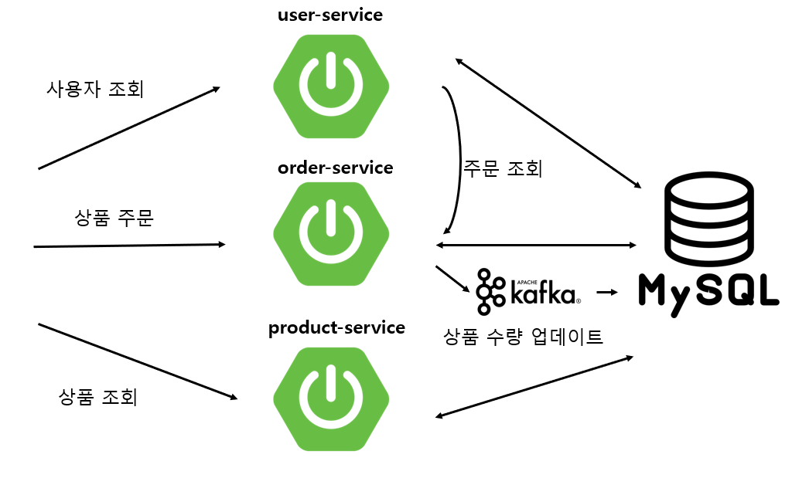

# Architecture


# 요구사항
- 상품 등록
```
POST /product-service/

// reuqest body
{
  "productName": "testBook",
  "stock": 10,
  "price": 1000
}
```

- 상품 조회
```
GET /product-service/products
```

- 상품 주문
```
POST /order-service/users/{userId}/orders

// request body
{
    "productId": "b8ba3e44-890c-4c16-9eae-219996d0f72a",
    "quantity": "2",
    "unitPrice": "1000"
}
```

- 주문한 상품 확인
  - 직접 요청도 되지만, FeignClient로 user-service에서 호출 가능하게 구현
```
GET /order-service/users/{userId}/orders
```


- 회원가입
```
POST /user-service/users

{
  "name": "testName",
  "identifier": "testId",
  "password": "testPassword"
}
```


- 사용자 정보 확인
```
GET /user-service/users/{userId}
```

```
```


- 상품 수량 업데이트
  - order-service에서 product-service로 message 전송


# 패키지 구성
- discovery-service
  - 라이브러리
    - Eureka Server
- api-gateway-service
  - 라이브러리
    - Eureka Discovery Client
    - Gateway
    - Lombock
- user-service, order-service, order-service
  - 라이브러리
    - Eureka Discovery Client
    - Spring Web
    - Lombok
    - valid
    - jpa
    - mysql


