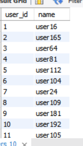
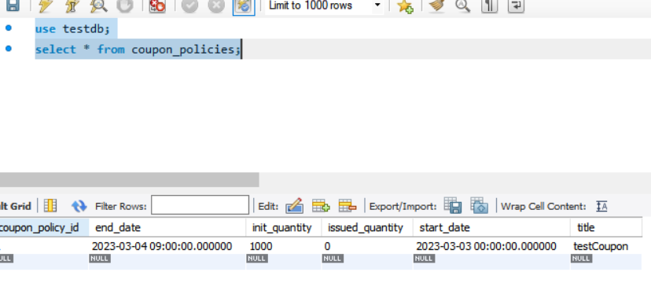
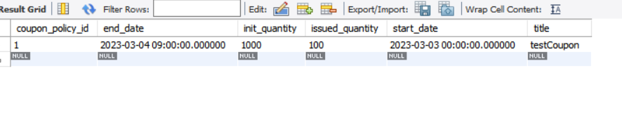
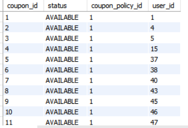

# 선착순 이벤트 처리
## 요구 사항
- 사용자가 쿠폰 발급 요청을 한다
  - 쿠폰 발급한 유저인지 확인
    - 이미 쿠폰을 발급한 유저는 더 발급 받을 수 없다
  - 남은 발급 가능한 쿠폰 수 확인
    - 아직 발급 가능한 쿠폰이 남아 있으면 발급
    - 발급 가능한 쿠폰을 모두 발급하면 발급 받을 수 없다
- 발급 요청 후 처리되기 전까지 대기 순위를 확인 할 수 있다

## 발생 가능한 문제
- 대규모 트래픽 처리
  - 응답 시간 초과
    - request timeout
  - 데이터베이스 커낵션 부족
    - HikariPool Connection is no available

## 해결 아이디어
- 서버를 발급 요청을 저장 처리/저장된 발급요청을 처리 두 가지로 분리
  - 발급 요청을 처리하는 서버에 로직이 줄어 처리량이 높아진다
  - 실제 발급을 하는 서버는 클라이언트의 트래픽으로 부터 자유롭다
- 두 서버 사이에 대기열로 redis에 sortedSet 자료구조 이용


# 결과
## Api
- user 생성
```
POST :8081/api/users
{
  "name": "name"
}
```

- couponPolicy 생성
```
POST :8081/api/coupon-policies
{
    "title": "testCoupon",
    "startDate": "2023-03-02T15:00:00.000Z",
    "endDate": "2023-03-04T00:00:00.000Z",
    "initQuantity": 1000
}
```

- coupon 신청
```
POST :8081/api/coupons
{
    "userId": 1,
    "couponPolicyId": 1,
    "couponTitle": "testCoupon"
}
```


- batch 시작
```
GET :8082/batch/coupons/testCoupon
```


## Traffic Report
- 시나리오 100명에 유저가 각 10번씩 쿠폰 신청을 광클(1초 안에 연속 클릭)한 상황을 실험
  - 총 100개에 쿠폰이 신청한 유저들에게 발급 되면 성공

- nGrinder를 이용한 결과 측정

|유형|user|측정 시간(분)|Error(개)|TPS|최고 TPS|
|---|---|---|---|---|---|
|normal |10|1|2|24.7|37.0|
|with redis|10|1|0|98.8|126.0|


## DataBase 

- 가입된 유저 정보



- 쿠폰 신청 이벤트 오픈 전 쿠폰 정책



- 쿠폰 신청 이벤트 종료 후 쿠폰 정책



- 발급된 쿠폰



